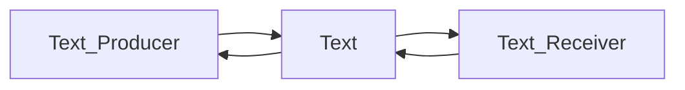
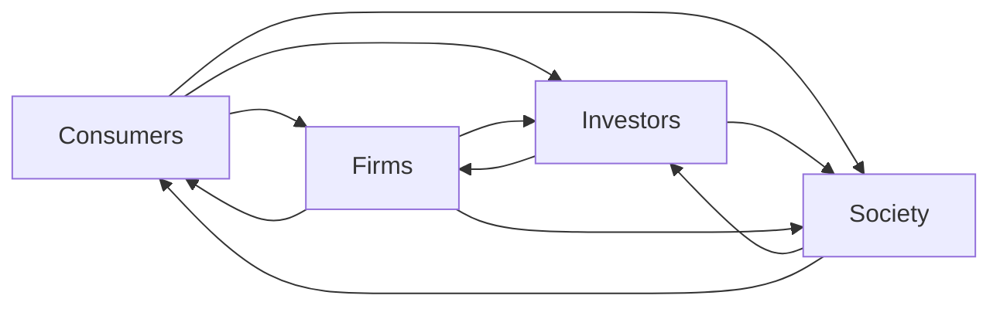
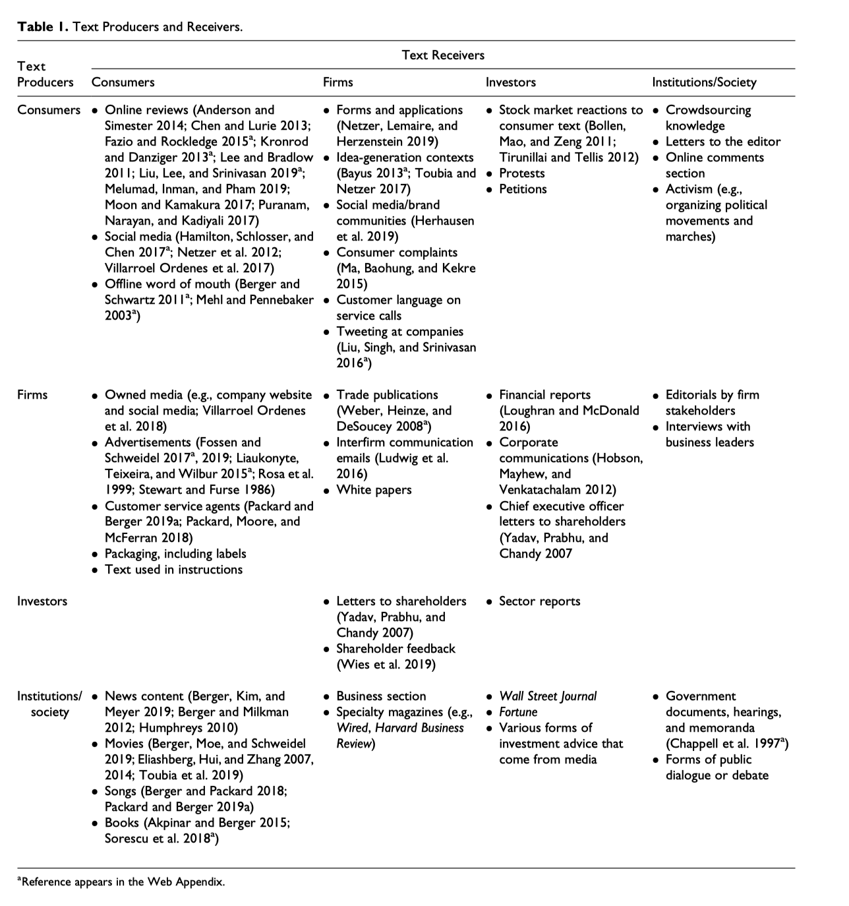
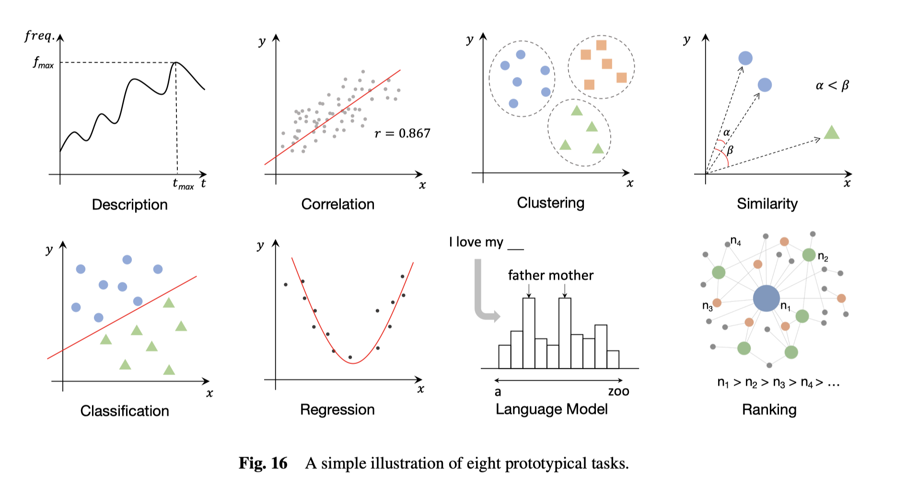
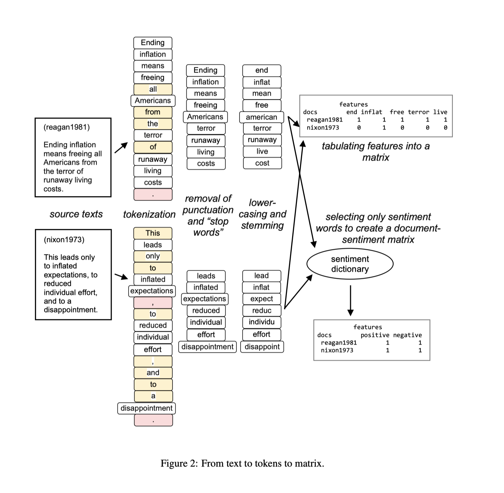

在大数据的今天，通过互联网超文本链接，无数的**个人、团体、公司、政府**等不同组织形态的主体均深深嵌入到互联网世界，在网络世界中留下了大量的文本。**社会、管理、经济、营销、金融**等不同学科，均可以研究网络上海量的文本，扩宽的研究对象和研究领域。下面大部分内容是三份文档翻译汇总而来，我觉得讲的挺明白的，其中加入了我的一点点理解和扩充。

## 一、文本产生及其作用方式

传播学的**编码解码理论**

- How text **reflects** its producer？
- How text **impacts** its receiver？

文本信息的**生产者producer** 与 **消费者receiver**，涵盖 **个人、公司(组织)、国家(社会)**三个层面。

> 文本的**反映Reflects**和**影响Impacts**并不是非此即彼，往往会同时起作用。

| ---          | 研究目的                                                     | 自变量X                                                      |
| ------------ | ------------------------------------------------------------ | ------------------------------------------------------------ |
| **Reflects** | 文本可以反映**producer**的一些信息，帮助研究者理解producer。 例如试图挖掘producer的个性personality或属于什么社会团体。 | 了解公司的品牌个性，调性； 。年报也会有未来业绩表现的有价值线索； 消费者们在品牌社区的言语能更深的投射出消费者对品牌的态度； 而更宏大的层面，文本也能反映出文化差异。"我"or“我们” 了解消费者是否喜欢新产品，消费者如何看待品牌，消费者最看重什么 |
| **Affects**  | 知道文本如何影响**receiver**，receiver会有什么样的行为和选择。 | 检验文本是否以及如何导致消费者诸如购买、分享和卷入行为。 广告会塑造消费者的消费行为 消费者杂志会扭曲消费者产品分类感知 电影剧本会影响观众的反应 |

  

## 二、如何使用文本数据

| ---               | Reflects                               | Affects                                      | 目的                                                         | 应用                                                         | 难点                                                         | 方法论基础                                                   |
| ----------------- | -------------------------------------- | -------------------------------------------- | ------------------------------------------------------------ | ------------------------------------------------------------ | ------------------------------------------------------------ | ------------------------------------------------------------ |
| **Predict**       | 预测 **producer**的状态、特性、性格等  | 预测 **receiver**阅读、分享和购买行为        | 研究人员不怎么关心任意的文本特质，他们更关心预测的表现。     | 什么消费者最喜欢贷款; 什么电影会大火; 未来股市走向;  | 文本数据可以生成成千上万的特征(相当于变量x1，x2...xn)，而文本数据**记录数**甚至可能少于特征数。 为了解决这个为题，使用新的特征分类方法，减少特征数量，又有可能存在拟合问题。 | **Predict**相似的人有相似的行为表现；相关性                  |
| **Understanding** | 为什么当人们压抑的时候会使用特殊人称。 | 来理解为何带有情绪的文本会更容易被阅读和分享 | 理解为什么事情发生以及如何发生的 这类研究往往会用到心理学、社会学的方法，旨在理解文本的什么特征会导致什么后续结果，以及为什么产生这样的后果。 | 消费者的表达会如何影响口碑; 为何某些推文会被挑中分享？  歌曲为何变火？  品牌如何让消费者忠诚？ | 找出观测数据背后的因果关系。相应的，该领域的工作可能会强调实验数据，以允许对关键的独立变量进行操作。 另一个挑战是解释文本特征之间的关系。 | **Understaning**文本分分析主要是提取一些变量x，用计量方法分析出因果关系 |

 

 

## 三、文本信息的指标

粗略的分，文本信息可以分为定性与定量两种类型

| 定性/量                             | 分析方法                                               | 优点                                                         | 缺点                                             |
| :---------------------------------- | ------------------------------------------------------ | ------------------------------------------------------------ | ------------------------------------------------ |
| **定性（text as text）**            | 质性（扎根）                                           | 依靠研究者领域知识，可以对少量的数据做出深刻洞见。           | 难以应对大规模数据； 编码过程并不能保证唯一； |
| **定量 textual data(text as data)** | 明显的文本特征，如词频、可阅读性、实体词（名词）的个数 | 标准如一; 适合大规模文本挖掘； 纷繁复杂中**涌现**出潜在规律 KK《复杂》 | 需要破坏文本的结构，丧失了部分信息量             |

**词典法，对某个词、某类词(词典)的统计个数多少**，特点容易理解，简单，实施性强。

- **数量**； 如文本长度(e.g., Godes and Mayzlin 2004; Moe and Trusov2011)

- **主观性**； 情感得分，情感词词典(e.g., Godes and Silva 2012; Moe and Schweidel 2012; Ying, Feinberg and Wedel 2006)·

- **客观性**

  ，如方差、信息墒(e.g., Godes and Mayzlin 2004).

  - A `产品不错， 包装破损， 态度很好， 综合还是推荐大家购买!` [5,1,5,4]
  - B`产品垃圾，使用垃圾， 包装破损， 差评!! ` [1, 1, 1, 1]
  - A和B谁的方差更大，信息量更客观公正?

- **实体词词频**； 例如“电脑”商品的在线评论中“电脑”出现次数会远多于其他词。

- **可读性**；阅读难易程度，根据词典或词的字母数测量

- **不确定性**；经济政策不确定性词典

- **相似度**: 两个文本向量cosine相似度

- **偏见，态度**；将每个词看做向量，对向量进行计算

  

## 四、文本分析步骤

以机器学习为例，

| 序号 | 步骤                             | 解释                                                         | 中文                                                     | 英文                                                         |
| ---- | -------------------------------- | ------------------------------------------------------------ | -------------------------------------------------------- | ------------------------------------------------------------ |
| 1    | **读取数据**                     | 数据一般存储于不同的文件夹不同文件内，需要将其导入到计算机   |                                                          |                                                              |
| 2    | **分词**                         | 导入到计算的文本是字符串数据，需要整理为更好用的列表         | 例如“我爱你中国”分词后 得到["我", "爱", "你", "中国"] | "I love China"分为 ["I", "love", "China"]                 |
| 3    | **剔除符号和无意义的停止(用)词** | 为了降低计算机运行时间，对分析结果影响较小的字符，诸如符号和无意义的词语需要剔除掉 | 如“的”，“她”， ”呢”， “了”                               | "is" , "a", "the"                                            |
| 4    | 同类型合并**字母变小写，词干化** | 同义词归并，同主体词归并                                     | “中铁”，“中国铁建”，“中铁集团”都可以归并为“中铁”         | 先变为小写，这样“I”和“i”都归并为“i”； “was”，“are”，“is”都归并为“be” |
| 5    | **构建  文档-词频-矩阵**         | 使用一定的编码方式，即用某种方式表示文本。常见的有**词袋法Bag of Words**、**Tf-Idf**； 可以使用scikit-learn构建文档词频矩阵，但中英文略有区别，需要注意 | “我爱你中国”需要先整理为“我 爱 你 中国”                  | “I love China”                                               |

  

## 经管-经典文本分析方法
在这里我把技术细分为词频、词袋、w2v建词典、w2v认知变迁四个维度，整理了经管7篇论文。大家可以阅读这7篇论文，掌握文本分析的应用场景。
| 文献                                                         | 定性 | 词频 | 词袋 | W2V建词典 | W2V认知变迁 |
| ------------------------------------------------------------ | ---- | ---- | ---- | --------- | ----------- |
| 王伟, 陈伟, 祝效国 and 王洪伟, 2016. 众筹融资成功率与语言风格的说服性--基于 Kickstarter 的实证研究. *管理世界*, (5), pp.81-98. | Y    | Y    |      |           |             |
| [语言具体性如何影响顾客满意度](https://hidadeng.github.io/blog/jcr_concreteness_computation/) Packard, Grant, and Jonah Berger. “How concrete language shapes customer satisfaction.” *Journal of Consumer Research* 47, no. 5 (2021): 787-806. |      | Y    |      |           |             |
| Wang, Quan, Beibei Li, and Param Vir Singh. "Copycats vs. original mobile apps: A machine learning copycat-detection method and empirical analysis." Information Systems Research 29, no. 2 (2018): 273-291. |      |      | Y    |           |             |
| [文本相似度](https://hidadeng.github.io/blog/2019-12-08-lazy-prices/) Cohen, L., Malloy, C. and Nguyen, Q., 2020. Lazy prices. *The Journal of Finance*, *75*(3), pp.1371-1415. |      |      | Y    |           |             |
| 胡楠, 薛付婧 and 王昊楠, 2021. [管理者短视主义](https://hidadeng.github.io/blog/text_mining_in_2021_management_world/)影响企业长期投资吗———基于文本分析和机器学习. *管理世界*, *37*(5), pp.139-156. |      | Y    |      | Y         |             |
| Kai Li, Feng Mai, Rui Shen, Xinyan Yan, [Measuring Corporate Culture Using Machine Learning](https://github.com/MS20190155/Measuring-Corporate-Culture-Using-Machine-Learning), The Review of Financial Studies, 2020 |      |      | Y    | Y         |             |
| 女性就职高管改变组织内性别偏见 Lawson, M. Asher, Ashley E. Martin, Imrul Huda, and Sandra C. Matz. "Hiring women into senior leadership positions is associated with a reduction in gender stereotypes in organizational language." *Proceedings of the National Academy of Sciences* 119, no. 9 (2022): e2026443119. |      |      |      |           | Y           |
| 使用词嵌入技术，量化近百年以来性别和族群的刻板印象 Garg, Nikhil, Londa Schiebinger, Dan Jurafsky, and James Zou. "Word embeddings quantify 100 years of gender and ethnic stereotypes." Proceedings of the National Academy of Sciences 115, no. 16 (2018): E3635-E3644. |      |      |      |           | Y           |

  

## 相关文献

> [1]Berger, Jonah, Ashlee Humphreys, Stephan Ludwig, Wendy W. Moe, Oded Netzer, and David A. Schweidel. "Uniting the tribes: Using text for marketing insight." Journal of Marketing (2019): 0022242919873106.
>
> [2]Kenneth Benoit. July 16, 2019. “[Text as Data: An Overview](https://kenbenoit.net/pdfs/28 Benoit Text as Data draft 2.pdf).” Forthcoming in Cuirini, Luigi and Robert Franzese, eds. *Handbook of Research Methods in Political Science and International Relations*. Thousand Oaks: Sage.
>
> [3]Banks, George C., Haley M. Woznyj, Ryan S. Wesslen, and Roxanne L. Ross. "A review of best practice recommendations for text analysis in R (and a user-friendly app)." *Journal of Business and Psychology* 33, no. 4 (2018): 445-459.
>
> [4]王伟,陈伟,祝效国,王洪伟. 众筹融资成功率与语言风格的说服性-基于Kickstarter的实证研究.管理世界.2016;5:81-98.
>
> [5]Wang, Quan, Beibei Li, and Param Vir Singh. "Copycats vs. original mobile apps: A machine learning copycat-detection method and empirical analysis." *Information Systems Research* 29, no. 2 (2018): 273-291.
>
> [6]Cohen, Lauren, Christopher Malloy, and Quoc Nguyen. "Lazy prices." *The Journal of Finance* 75, no. 3 (2020): 1371-1415.
>
>[7]冉雅璇,李志强,刘佳妮,张逸石.大数据时代下社会科学研究方法的拓展——基于词嵌入技术的文本分析的应用[J/OL].南开管理评论:1-27[2022-04-08].http://kns.cnki.net/kcms/detail/12.1288.F.20210905.1337.002.html
>
>[8]Chen, H., Yang, C., Zhang, X., Liu, Z., Sun, M. and Jin, J., 2021. From Symbols to Embeddings: A Tale of Two Representations in Computational Social Science. Journal of Social Computing, 2(2), pp.103-156.